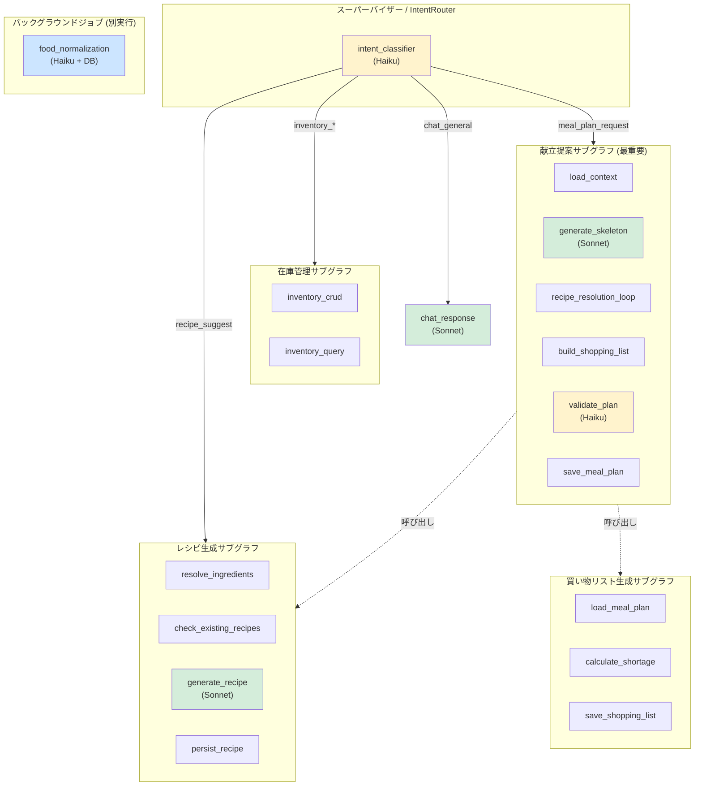
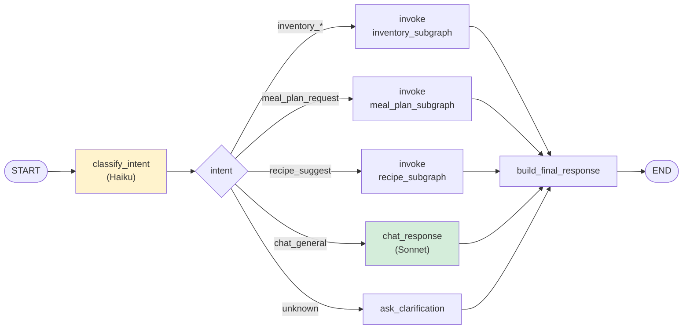
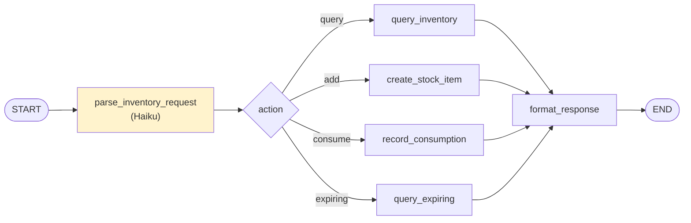
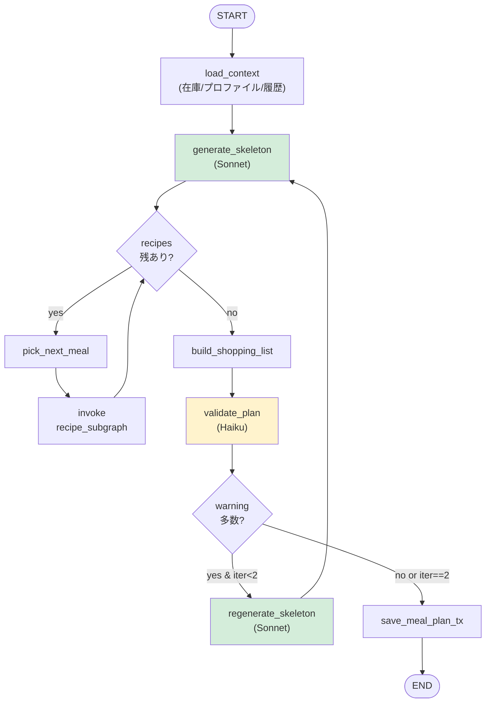
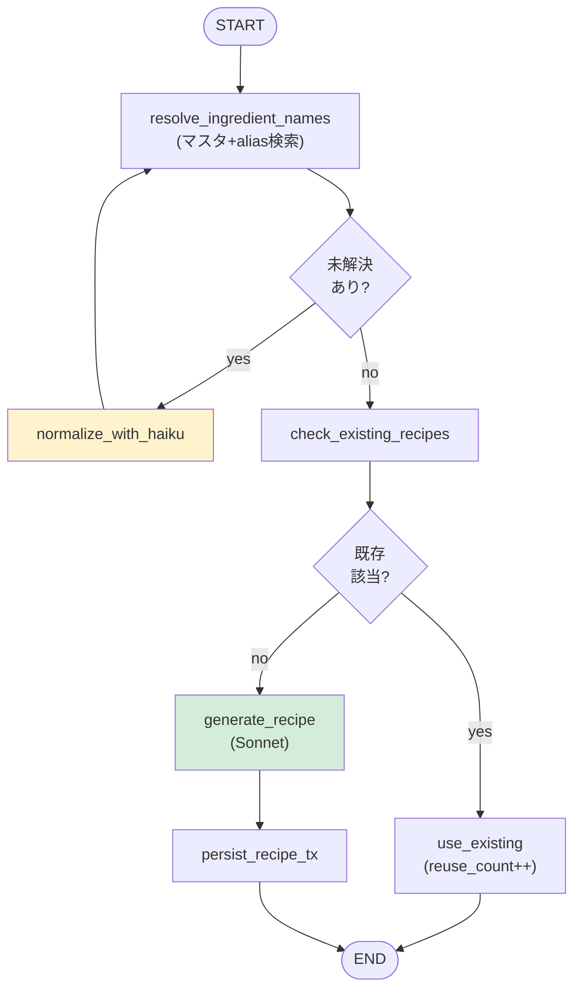
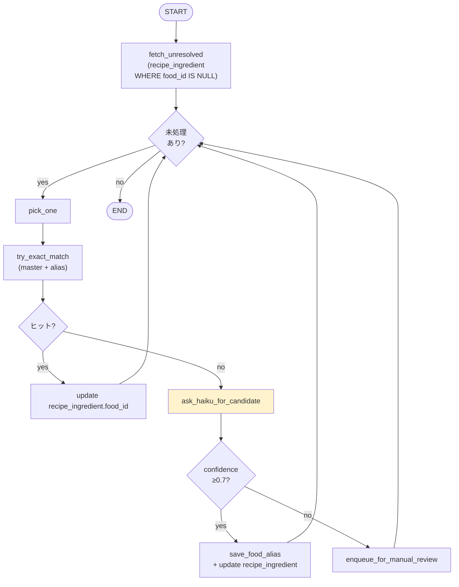

# LangGraph ステートグラフ設計書 v0.2

<document_meta>
- **対応文書**: 要件定義書_v0.3.md, データモデル詳細設計書_v0.3.md, OpenAPI設計書_v0.3.md
- **作成日**: 2026-05-24
- **更新日**: 2026-06-05（設計反映書_v0.4 §1.4 を取り込み）
- **LangGraph バージョン**: 0.2+（StateGraph, Subgraph, Checkpointer想定）
- **LLM プロバイダ**: Anthropic API（Claude Sonnet / Haiku）
- **実装モデルID**: `claude-sonnet-4-6`（Sonnet）、`claude-haiku-4-5-20251001`（Haiku）
</document_meta>

---

## 0. 本書の構成

| 章 | 内容 |
|----|------|
| 1 | 設計方針 |
| 2 | 全体アーキテクチャ |
| 3 | 共有State 定義 |
| 4 | グラフ詳細（各エージェント） |
| 5 | ツールカタログ |
| 6 | エラーハンドリング戦略 |
| 7 | 永続化・チェックポイント |
| 8 | オブザーバビリティ |
| 9 | プロンプト設計指針 |
| 10 | テスト戦略 |
| 11 | 検討事項 |
| 12 | 次のアクション |

---

## 1. 設計方針

| # | 方針 | 根拠 |
|---|------|------|
| 1 | **階層型グラフ構成**: 1つのスーパーバイザー＋複数のサブグラフ | 関心の分離、独立テスト可能 |
| 2 | エージェントごとに **独立した TypedDict State**、上位グラフは集約State | 型安全性とスコープの明確化 |
| 3 | LLM 呼び出しは **モデル別ラッパー**（`sonnet_llm`, `haiku_llm`）で抽象化 | コスト管理・モデル切替の容易性 |
| 4 | ツールは **LangChain `@tool` デコレータ**で定義し、エージェント単位で bind | 型・スキーマの自動生成、再利用 |
| 5 | DB操作は **専用のRepository層**を介し、ツールは Repository を呼ぶ | テスト容易性、トランザクション境界の明示 |
| 6 | エラーは State に蓄積し、後続ノードで判断 | リトライ・部分成功への対応 |
| 7 | チェックポイントは **SqliteSaver**（同一NAS上に別ファイル）または インメモリ | MVP は再開不要なら不使用も可 |
| 8 | LLM ストリーミングは MVP では使わず、ノード単位でブロッキング | 同期API（API-02確定）と整合 |

---

## 2. 全体アーキテクチャ

### 2.1 階層構造



### 2.2 呼び出しパス

- `/agent/chat` → スーパーバイザー（IntentRouter）→ サブグラフへ振り分け
- `/meal-plans` POST → 献立提案サブグラフを直接起動（IntentRouter経由しない）
- `/recipes/suggest` POST → レシピ生成サブグラフを直接起動
- 食材正規化は cron 等でバックグラウンドジョブとして単独起動

> **理由**: REST API側で意図が明確な場合は IntentRouter を経由する必要がない。`/agent/chat` のみ自然言語ルーティングを使う。

---

## 3. 共有State 定義

### 3.1 トップレベル状態（スーパーバイザー用）

```python
from typing import TypedDict, Annotated, Literal, Any
from operator import add
from datetime import datetime

class SupervisorState(TypedDict):
    # 入力
    user_message: str
    session_id: str | None
    context: dict[str, Any]  # フロントからの追加情報

    # ルーティング結果
    intent: Literal[
        "inventory_query", "inventory_update",
        "meal_plan_request", "recipe_suggest",
        "chat_general", "unknown"
    ] | None
    routing_confidence: float | None

    # サブグラフ実行結果
    sub_result: dict[str, Any] | None

    # 最終応答
    final_response: dict[str, Any] | None
    follow_up_suggestions: list[str]

    # メタ
    errors: Annotated[list[dict], add]  # 累積
    llm_calls: Annotated[list[dict], add]  # 累積（コスト追跡）
    started_at: str
```

### 3.2 献立提案サブグラフ用

```python
class MealPlanRequest(TypedDict):
    start_date: str  # YYYY-MM-DD
    end_date: str
    preferences: str | None  # 自然言語要望
    meal_types: list[str]  # ["breakfast", "lunch", "dinner"]

class MealStub(TypedDict):
    served_date: str
    meal_type: str
    main_ingredients: list[int]  # food_id
    constraints: dict  # cook_time_max など

class MealPlanState(TypedDict):
    # 入力
    request: MealPlanRequest

    # ロード済みコンテキスト
    current_inventory: list[dict]
    expiring_inventory: list[dict]
    family_profile: dict
    recent_meal_history: list[dict]

    # 中間生成物
    meal_skeleton: list[MealStub]
    resolved_recipes: dict[int, dict]  # meal_stub_index → recipe
    pending_recipe_indices: list[int]
    shopping_list_items: list[dict]
    validation_warnings: list[str]

    # 最終生成物
    meal_plan_id: int | None

    # メタ
    errors: Annotated[list[dict], add]
    llm_calls: Annotated[list[dict], add]
    iteration_count: int  # 検証→修正ループの上限管理
```

### 3.3 レシピ生成サブグラフ用

```python
class RecipeGenState(TypedDict):
    # 入力
    target_ingredients: list[str]  # 名前 or ID（要解決）
    constraints: dict  # cook_time_max, family_profile, etc.
    use_existing: bool  # DB照会を行うか

    # 解決済み
    resolved_food_ids: list[int]
    unresolved_names: list[str]

    # マッチング
    candidate_recipes: list[dict]  # 既存DBから
    needs_generation: bool

    # 生成物
    generated_recipe: dict | None
    saved_recipe_id: int | None

    # メタ
    source: Literal["db_match", "llm_generated"] | None
    errors: Annotated[list[dict], add]
    llm_calls: Annotated[list[dict], add]
```

---

## 4. グラフ詳細

### 4.1 IntentRouter（スーパーバイザー）

#### 4.1.1 グラフ構造



#### 4.1.2 ノード詳細

| ノード | LLM | 処理内容 |
|--------|-----|---------|
| classify_intent | Haiku | system promptで意図分類、JSON出力 |
| inventory_subgraph (invoke) | - | サブグラフ呼出 |
| meal_plan_subgraph (invoke) | - | サブグラフ呼出 |
| recipe_subgraph (invoke) | - | サブグラフ呼出 |
| chat_response | Sonnet | 一般会話、システムに関する説明 |
| ask_clarification | Haiku | 「何をしたいですか?」と聞き返す |
| build_final_response | - | `AgentChatResponse` 形式に整形 |

#### 4.1.3 classify_intent プロンプト概念

```
You are an intent classifier for a household inventory and meal-planning system.
Classify the user's message into one of:
- inventory_query: 在庫の確認、検索、期限切迫の問い合わせ
- inventory_update: 在庫の追加・更新・消費
- meal_plan_request: 1週間献立の生成依頼
- recipe_suggest: 特定食材でのレシピ提案
- chat_general: 上記に当てはまらない一般質問
- unknown: 解釈不能

Respond as JSON:
{ "intent": "...", "confidence": 0.0-1.0, "rationale": "..." }
```

#### 4.1.4 コード骨格

```python
from langgraph.graph import StateGraph, START, END
from langchain_anthropic import ChatAnthropic

haiku = ChatAnthropic(model="claude-haiku-4-5-20251001", temperature=0)
sonnet = ChatAnthropic(model="claude-sonnet-4-6", temperature=0.7)

def classify_intent(state: SupervisorState) -> dict:
    response = haiku.invoke([
        {"role": "system", "content": INTENT_SYSTEM_PROMPT},
        {"role": "user", "content": state["user_message"]}
    ])
    parsed = json.loads(response.content)
    return {
        "intent": parsed["intent"],
        "routing_confidence": parsed["confidence"],
        "llm_calls": [{"model": "haiku", "purpose": "intent", "tokens": response.usage}]
    }

def route_by_intent(state: SupervisorState) -> str:
    intent = state["intent"]
    if intent in ("inventory_query", "inventory_update"):
        return "inventory_subgraph"
    elif intent == "meal_plan_request":
        return "meal_plan_subgraph"
    elif intent == "recipe_suggest":
        return "recipe_subgraph"
    elif intent == "chat_general":
        return "chat_response"
    else:
        return "ask_clarification"

graph = StateGraph(SupervisorState)
graph.add_node("classify_intent", classify_intent)
graph.add_node("inventory_subgraph", inventory_subgraph_compiled)
graph.add_node("meal_plan_subgraph", meal_plan_subgraph_compiled)
graph.add_node("recipe_subgraph", recipe_subgraph_compiled)
graph.add_node("chat_response", chat_response_node)
graph.add_node("ask_clarification", ask_clarification_node)
graph.add_node("build_final_response", build_final_response)

graph.add_edge(START, "classify_intent")
graph.add_conditional_edges("classify_intent", route_by_intent)
for n in ["inventory_subgraph", "meal_plan_subgraph", "recipe_subgraph",
         "chat_response", "ask_clarification"]:
    graph.add_edge(n, "build_final_response")
graph.add_edge("build_final_response", END)

supervisor = graph.compile()
```

---

### 4.2 在庫管理エージェント

CRUD中心のためグラフは小さい。むしろツール群として実装する選択肢もあるが、ここでは明示的にグラフ化。

#### 4.2.1 グラフ構造



- すべて DB ツール呼び出しで完結
- LLM は parse_inventory_request のみで利用

---

### 4.3 献立提案エージェント（最重要）

#### 4.3.1 グラフ構造



#### 4.3.2 ノード詳細

| ノード | LLM | 処理内容 |
|--------|-----|---------|
| load_context | - | DB から在庫、家族プロファイル、直近30日の meal_history を取得 |
| generate_skeleton | Sonnet | 1週間分の食事スケルトン（日付/食事タイプ/主材料食材ID）を生成。期限切迫品を優先利用 |
| pick_next_meal | - | `pending_recipe_indices` から次の meal を選択 |
| invoke recipe_subgraph | - | レシピ生成サブグラフを呼出（既存DB優先＋必要ならLLM生成） |
| build_shopping_list | - | 計算ロジック（データモデル設計書 9.1）で不足量算出 |
| validate_plan | Haiku | アレルゲン・連続日同一料理・栄養偏りをチェック、警告リスト返却 |
| regenerate_skeleton | Sonnet | warnings を踏まえて再生成（最大1回） |
| save_meal_plan_tx | - | DBトランザクション内で meal_plan + meals + shopping_list を保存 |

#### 4.3.3 generate_skeleton プロンプト構造

```
[System]
あなたは家庭の献立プランナーです。在庫食材を優先的に使い、家族の嗜好と栄養バランスを考慮した1週間の食事案を作成します。

[Context]
- 在庫食材: {inventory_summary}
- 期限切迫品 (3日以内): {expiring_items}  ← これらを優先的に消費すること
- 家族プロファイル: 大人2名、嗜好={likes}, 苦手={dislikes}, アレルゲン={allergens}
- 直近の献立履歴: {recent_meals}  ← 連続重複を避ける
- 要望: {user_preferences}
- 対象期間: {start_date} 〜 {end_date}
- 食事タイプ: {meal_types}

[Task]
各食事について以下を JSON で出力してください:
{
  "meals": [
    {
      "served_date": "YYYY-MM-DD",
      "meal_type": "breakfast|lunch|dinner",
      "concept": "メイン料理の概略 (例: 鶏の照り焼き)",
      "main_ingredient_food_ids": [12, 30],
      "cook_time_min_estimate": 25,
      "rationale": "なぜこれを提案するかの短い理由"
    },
    ...
  ]
}

各レシピの詳細手順は別途生成するので、ここでは概略でOK。
```

#### 4.3.4 制御フロー上の注意

- `recipe_subgraph` をループ内で呼ぶため、並列実行も検討余地（asyncio.gather）。MVPは逐次。
- `iteration_count` で `regenerate_skeleton` の上限を設ける（無限ループ防止）。
- 全体タイムアウト 90秒以内に収めるため、各ノード時間予算を意識:
  - load_context: 1秒以下
  - generate_skeleton: 10-15秒
  - recipe_loop (21回想定): 平均1秒/回 → 21秒 (DB hit が多ければ短縮)
  - shopping/validate: 5秒以下
  - persist: 1秒以下

---

### 4.4 レシピ生成エージェント

#### 4.4.1 グラフ構造



#### 4.4.2 重要ロジック

- `resolve_ingredient_names`: `food_master.name` と `food_alias.alias` で完全一致検索
- `normalize_with_haiku`: 未解決名に対して Haiku を呼び、food_master 一覧から最も近いものを推定。confidence ≥ 0.7 で food_alias に保存し再解決
- `check_existing_recipes`: 主材料の被り率70%以上のレシピをスコア順で取得（データモデル設計書 4.2/4.5）
- `generate_recipe`: Sonnet にレシピ生成依頼。出力JSONには materials（raw_name 含む）と instructions_md
- `persist_recipe_tx`: 1トランザクションで recipe + recipe_ingredient（複数）を INSERT。raw_name は保存しつつ food_id 解決可能なものは設定

---

### 4.5 買い物リスト生成エージェント

献立提案サブグラフから呼ばれる小さなグラフ。


ロジック詳細はデータモデル設計書 9.1 参照。

---

### 4.6 食材名正規化エージェント（バックグラウンド）

cron で日次実行を想定。LangGraph で書く必然性は低いが、再利用性のため同じ枠組みで実装。



---

## 5. ツールカタログ

エージェントがLLMに bind するツール群を Repository 層と分離して定義する。

### 5.1 在庫系ツール

| ツール名 | 用途 | 引数 | 返り値 |
|---------|-----|------|-------|
| `inventory_get_by_food_id` | 食材IDで在庫検索 | food_id | list[StockItem] |
| `inventory_list_expiring` | 期限切迫品取得 | days=3 | list[StockItem] |
| `inventory_search` | 自由検索 | query, category | list[StockItem] |
| `inventory_record_transaction` | 在庫増減記録 | stock_item_id, tx_type, quantity_delta | StockTransaction |

### 5.2 食材マスタ系ツール

| ツール名 | 用途 | 引数 | 返り値 |
|---------|-----|------|-------|
| `food_master_list` | 一覧 | category? | list[Food] |
| `food_master_resolve_name` | 名前 → ID (alias含む) | name | int or None |
| `food_master_create` | 新規追加 | name, category | Food |
| `food_alias_create` | エイリアス追加 | food_id, alias, source, confidence | FoodAlias |

### 5.3 レシピ系ツール

| ツール名 | 用途 | 引数 | 返り値 |
|---------|-----|------|-------|
| `recipe_search_by_main_ingredients` | 主材料マッチ | food_ids, limit | list[Recipe] |
| `recipe_search_by_similarity` | 食材セット類似度 | food_ids, threshold | list[Recipe] |
| `recipe_get` | 詳細取得 | recipe_id | Recipe |
| `recipe_create` | 保存 | name, instructions_md, ingredients | Recipe |
| `recipe_increment_reuse_count` | 再利用カウント++ | recipe_id | - |

### 5.4 献立系ツール

| ツール名 | 用途 | 引数 | 返り値 |
|---------|-----|------|-------|
| `meal_plan_create` | meal_plan 作成 | start_date, end_date, meals | MealPlan |
| `meal_get_recent_history` | 直近の meal | days=30 | list[Meal] |
| `meal_consume_inventory` | 調理消費 | meal_id | list[StockTransaction] |

### 5.5 ファミリープロファイル系

| ツール名 | 用途 | 引数 | 返り値 |
|---------|-----|------|-------|
| `family_profile_get_all` | 全プロファイル取得 | - | list[FamilyProfile] |

### 5.6 ツール定義例

```python
from langchain_core.tools import tool
from typing import Optional

@tool
def recipe_search_by_main_ingredients(
    food_ids: list[int],
    limit: int = 3
) -> list[dict]:
    """指定された主材料食材IDで既存レシピを検索する。
    アーカイブ済みは除外、is_favorite と reuse_count でソート。"""
    return RecipeRepository().search_by_main(food_ids, limit)

@tool
def inventory_list_expiring(days: int = 3) -> list[dict]:
    """指定日数以内に賞味期限が切れる在庫を取得する。"""
    return StockRepository().list_expiring(days)
```

エージェント側で bind:
```python
meal_planner_tools = [
    inventory_get_by_food_id,
    inventory_list_expiring,
    meal_get_recent_history,
    family_profile_get_all,
    recipe_search_by_main_ingredients,
]
sonnet_for_meal = sonnet.bind_tools(meal_planner_tools)
```

---

## 6. エラーハンドリング戦略

### 6.1 エラーカテゴリと対応

| カテゴリ | 例 | 対応 |
|---------|-----|------|
| LLM API 失敗 | タイムアウト、レート制限、5xx | 指数バックオフで最大3回リトライ。最終的に失敗したら部分結果で進行 or ユーザーへエラー返却 |
| ツール呼び出し失敗 | DB接続エラー | リトライ1回。失敗時は State.errors に蓄積し、続行可否を判断 |
| 出力JSONパース失敗 | LLM出力が壊れている | 1回 reformat 指示で再試行（Haiku）。失敗時はデフォルト値 or エラー |
| ビジネスルール違反 | アレルゲン混入を提案など | validate ノードで検出、warnings に追加、最大1回 regenerate |
| タイムアウト | 全体90秒超過 | グラフ全体に asyncio.wait_for で timeout。部分結果を返す or 504 |

### 6.2 リトライポリシー

```python
import tenacity

@tenacity.retry(
    stop=tenacity.stop_after_attempt(3),
    wait=tenacity.wait_exponential(min=1, max=10),
    retry=tenacity.retry_if_exception_type(AnthropicAPIError)
)
def call_sonnet_with_retry(messages):
    return sonnet.invoke(messages)
```

### 6.3 部分成功の扱い

- 1週間献立の一部レシピ生成に失敗 → 失敗した meal は `recipe_id=NULL` で保存、ユーザーに警告を返す
- 在庫消費トランザクションで一部の食材が見つからない → 見つかったものだけ消費、未消費は警告

### 6.4 State.errors のスキーマ

```python
class ErrorRecord(TypedDict):
    node: str  # エラー発生ノード名
    type: str  # 'llm_failure', 'tool_failure', 'parse_error', 'validation_failure'
    detail: str
    timestamp: str
    retryable: bool
```

---

## 7. 永続化・チェックポイント

### 7.1 MVP方針

- 同期API（API-02）かつ短時間処理（90秒以内）のため、**MVPはチェックポイント不要**
- インメモリ実行で十分

### 7.2 Phase 2 で導入する場合

- `langgraph.checkpoint.sqlite.SqliteSaver` を使用
- DBファイルは `kitchen_app.db`（メイン）とは別の `langgraph_checkpoints.db` にする
- 用途:
  - 中断された /agent/chat セッションの再開
  - 長時間ジョブ（バックグラウンドの食材正規化）の再開
  - デバッグ・リプレイ

### 7.3 セッション管理

- `/agent/chat` の `session_id` は LangGraph の `thread_id` として使う
- スレッドごとに独立した状態履歴を保持

---

## 8. オブザーバビリティ

### 8.1 LLM 呼び出しログ

State の `llm_calls` フィールドに各呼び出しを蓄積:
```python
{
    "model": "claude-sonnet-4-6",
    "purpose": "meal_skeleton_generation",
    "input_tokens": 1200,
    "output_tokens": 800,
    "cost_estimate_yen": 0.5,
    "duration_ms": 8200,
    "timestamp": "2026-05-24T10:00:00Z"
}
```

API レスポンスのデバッグヘッダ or 専用エンドポイント（`/admin/llm-cost-summary`）で確認可能にする。

### 8.2 LangSmith 連携（推奨）

環境変数で有効化:
```
LANGCHAIN_TRACING_V2=true
LANGCHAIN_API_KEY=...
LANGCHAIN_PROJECT=kitchen-agent
```

トレース内容:
- 各ノードの実行時間
- LLM プロンプト・レスポンス
- ツール呼び出し
- 全体のステートグラフ実行

> **MVP判断**: LangSmith は無料枠あり、家庭利用なら問題なし。最初から有効化推奨。

### 8.3 アプリケーションログ

- 各ノード開始・終了で構造化ログ（JSON）
- レベル: INFO（通常）、WARN（リトライ）、ERROR（失敗）
- 出力先: stdout（Docker logs）+ ファイルローテーション（永続化）

---

## 9. プロンプト設計指針

### 9.1 共通ルール

- **System プロンプトは長期不変、コンテキストは User メッセージで渡す**
- **出力は JSON 形式に統一**（パース容易性、構造化抽出）
- 日本語ベース、技術用語は必要に応じ英語併記
- 例示（few-shot）は最小限、コンテキストで十分な場合は使わない

### 9.2 プロンプト保管場所

- `prompts/` ディレクトリに `.md` ファイルで保管
- 例: `prompts/meal_skeleton_v1.md`, `prompts/recipe_generation_v1.md`
- バージョニング: ファイル名末尾に `_v1`, `_v2`
- アプリ側で動的に読み込み

### 9.3 主要プロンプト一覧

| 用途 | ファイル | モデル |
|------|---------|-------|
| インテント分類 | `intent_classifier_v1.md` | Haiku |
| 1週間献立スケルトン生成 | `meal_skeleton_v1.md` | Sonnet |
| レシピ生成（詳細） | `recipe_generation_v1.md` | Sonnet |
| 食材名正規化 | `food_normalization_v1.md` | Haiku |
| 献立の検証 | `meal_plan_validation_v1.md` | Haiku |
| 一般会話応答 | `chat_response_v1.md` | Sonnet |

---

## 10. テスト戦略

### 10.1 ノード単位テスト

- 各ノードを純粋関数として実装（state in → partial state out）
- LLM呼び出しはモック化（決定論的テスト）
- DB操作も Repository をモック化

### 10.2 サブグラフ単位テスト

- 各サブグラフ（meal_planner, recipe_gen 等）を独立に実行
- 想定インプットでフローが正しく流れるか確認
- ループ・条件分岐のカバレッジ

### 10.3 統合テスト

- スーパーバイザー含む全体フロー
- 実DB（テスト用 SQLite）使用
- LLMはモック or LangSmith Recordings

### 10.4 LLM プロンプト評価

- 想定入力 100件程度のテストセット
- 期待出力（JSON構造の妥当性、ビジネスルール遵守）を検証
- Phase 1 で 50件、Phase 2 で 100件以上に拡充

---

## 11. 検討事項

| # | 論点 | 選択肢 | 推奨 |
|---|------|-------|------|
| LG-01 | recipe_loop の並列化 | 逐次 / asyncio 並列 | **MVPは逐次**、Phase 2で並列化検討 |
| LG-02 | 検証→再生成ループの上限 | 1回 / 2回 / 上限なし | **1回**（タイムアウト予算上） |
| LG-03 | LangSmith 連携 | MVP有効 / Phase 2 | **MVP有効**（無料枠で十分） |
| LG-04 | チェックポインター | 無 / SqliteSaver / インメモリ | **MVPは無**、Phase 2で SqliteSaver |
| LG-05 | プロンプトのバージョン管理 | ファイル名 / DB | **ファイル名末尾 `_v1`** |
| LG-06 | 食材正規化バッチの実行頻度 | 日次 / リアルタイム / 手動 | **日次cron** + 手動トリガーAPI |
| LG-07 | ツール定義の場所 | エージェントファイル内 / 共通ファイル | **共通 `tools/` ディレクトリ** |
| LG-08 | サブグラフのコンパイル単位 | 起動時1回 / リクエスト毎 | **起動時1回**（パフォーマンス） |

---

## 12. 次のアクション

1. ~~LangGraph設計~~ ✅本書
2. ~~LG-01〜LG-08 の意思決定~~ ✅推奨案で確定
3. ~~docker-compose.yml の骨組み作成~~ ✅
4. ~~プロンプトファイル雛形作成~~ ✅ (`prompts/meal_skeleton_v1.md`, `recipe_generation_v1.md` 等)
5. PoC実装
   - ~~Phase 0a: docker-compose 起動、health endpoints~~ ✅
   - ~~Phase 0b: 在庫CRUD最小実装~~ ✅
   - ~~Phase 0c: スケルトン献立提案 + 詳細レシピ生成~~ ✅（2026-06-05完了）
     - 実装: `backend/src/agents/meal_agent.py`（`build_skeleton_graph` / `build_recipe_graph`）
     - スケルトン: Sonnet 1回呼出、`POST /api/v1/meal-plans`
     - レシピ詳細: Sonnet オンデマンド、`POST /api/v1/meals/{id}/recipe`
   - **Phase 1: 全エージェント統合、PWA連携** ← 次はここ
