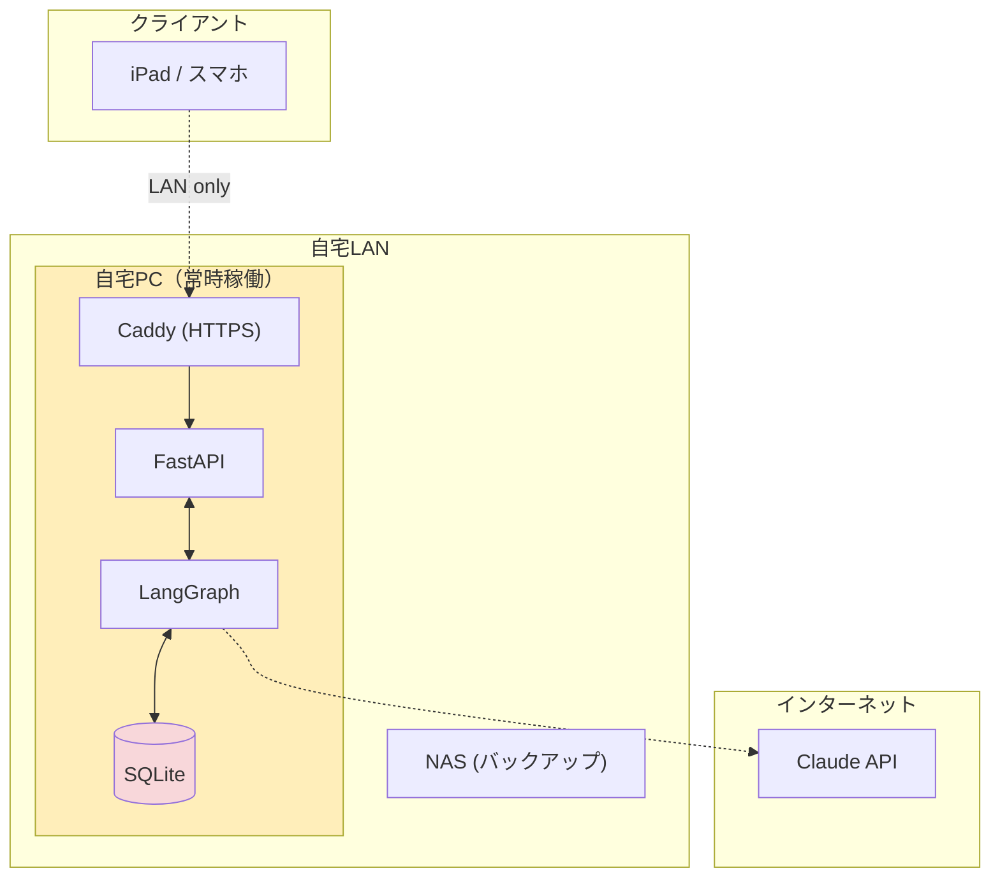
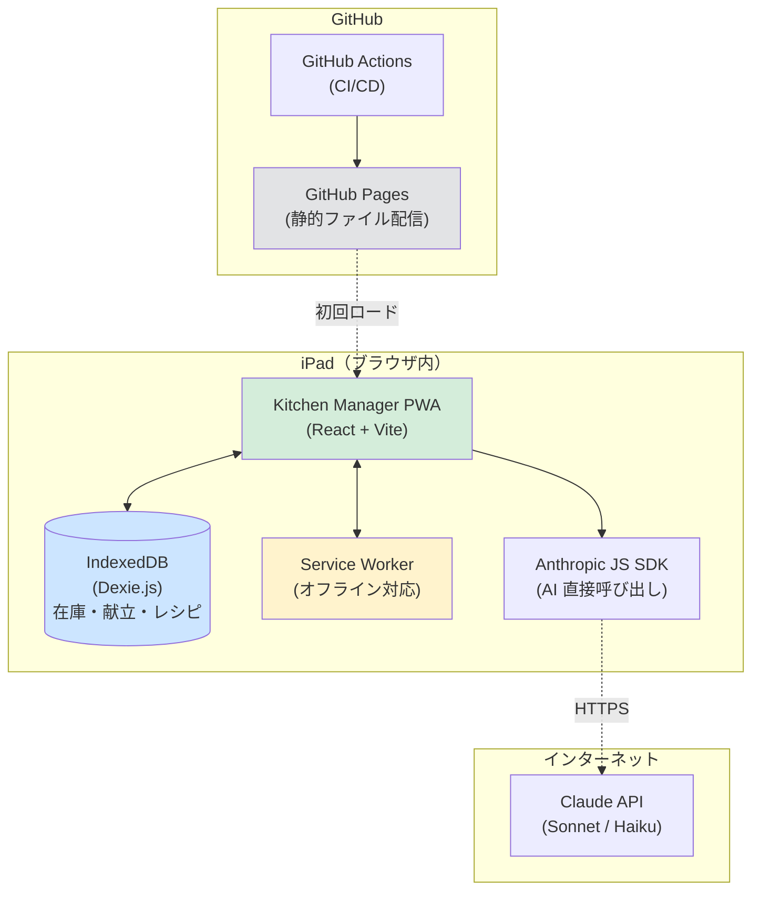
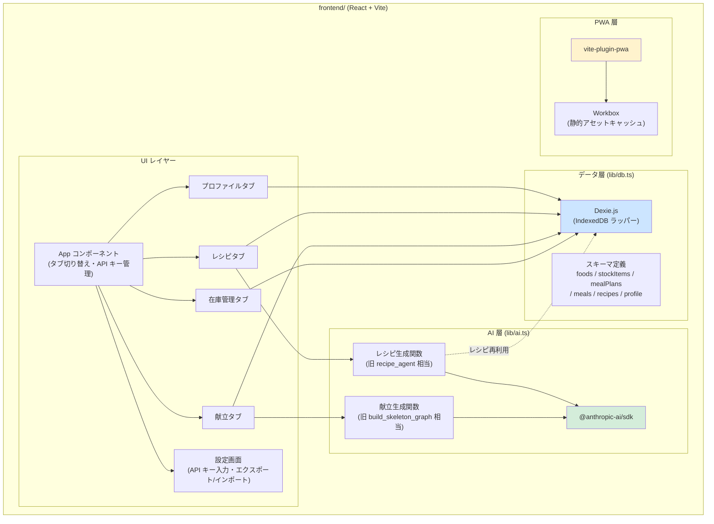
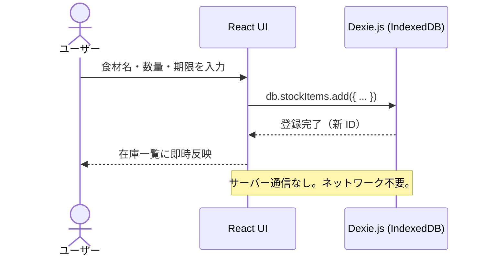
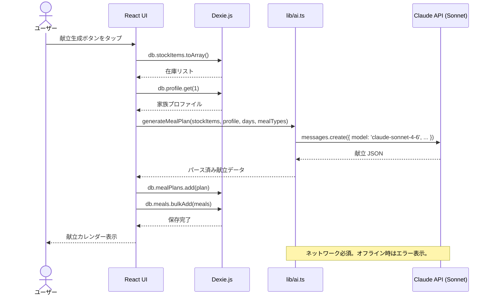
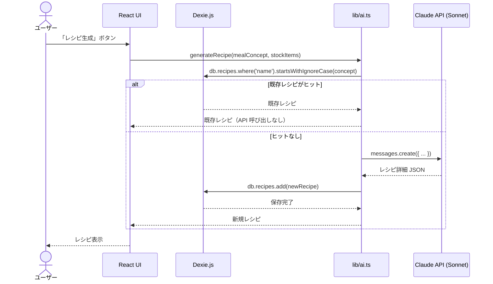
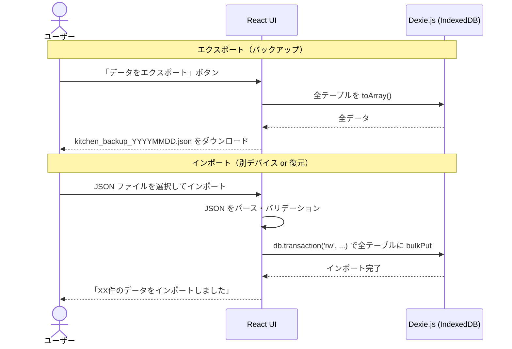
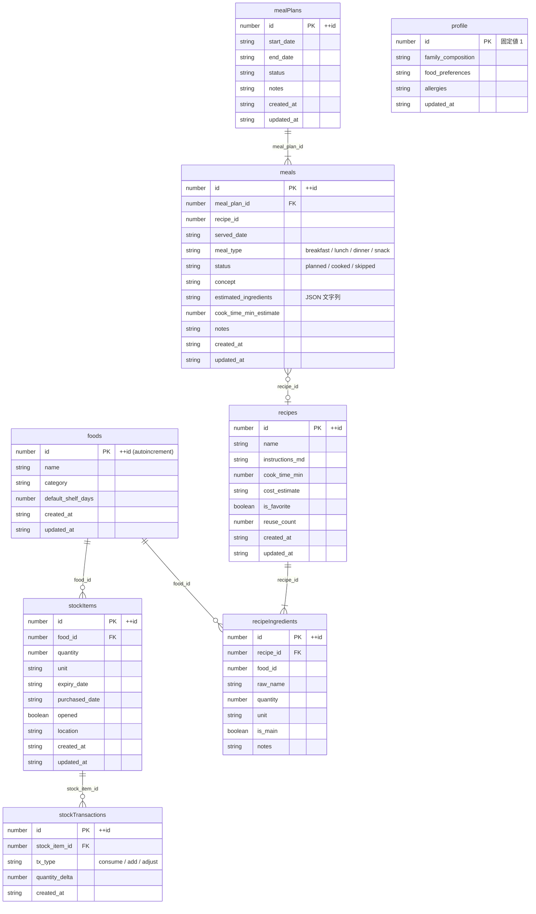

# iPad PWA 移行 構成図 v1.0

<document_meta>
- **作成日**: 2026-06-27
- **対応要件定義書**: ipad_pwa_要件定義書_v1.0.md
- **対象ブランチ**: feature/ipad-pwa-migration
</document_meta>

---

## 1. 新旧システム全体構成の比較

### 旧構成（サーバーあり）



### 新構成（サーバーなし）



---

## 2. コンポーネント構成図



---

## 3. データフロー図

### 3.1 在庫操作フロー（完全オフライン動作）



### 3.2 献立提案フロー（オンライン必須）



### 3.3 レシピ生成フロー（DB 再利用 → 不足時のみ AI）



### 3.4 エクスポート / インポートフロー（デバイス間データ移行）



---

## 4. IndexedDB スキーマ（Dexie.js）



**Dexie インデックス定義（主要）**:

| テーブル | インデックス | 用途 |
|---------|------------|------|
| `stockItems` | `food_id`, `expiry_date` | カテゴリ絞り込み・期限切迫検索 |
| `meals` | `meal_plan_id`, `served_date` | プラン別・日付別取得 |
| `recipes` | `name`, `is_favorite`, `reuse_count` | 名前検索・お気に入り・再利用順ソート |
| `recipeIngredients` | `recipe_id`, `food_id` | レシピ別食材取得・食材指定検索 |

---

## 5. デプロイ構成図（GitHub Pages + Actions）

```mermaid
graph LR
    subgraph Dev["開発環境 (WSL2)"]
        Code["ソースコード編集"]
        LocalDev["vite dev server\n(動作確認)"]
    end

    subgraph GitHub["GitHub"]
        Repo["リポジトリ\nmain ブランチ"]
        Actions["GitHub Actions\n.github/workflows/deploy.yml"]
        Pages["GitHub Pages\nghttps://username.github.io/kitchen"]
    end

    subgraph iPad["iPad"]
        Safari["Safari\n(初回アクセス)"]
        HomeApp["ホーム画面アプリ\n(PWA インストール済み)"]
        SW["Service Worker\n(静的アセットをキャッシュ)"]
    end

    Code -->|git push| Repo
    Repo -->|trigger| Actions
    Actions -->|vite build + deploy| Pages
    Pages -.HTTPS.-> Safari
    Safari -->|ホーム画面に追加| HomeApp
    Pages -.初回ロード.-> SW
    SW -.オフライン時に提供| HomeApp

    style Pages fill:#e2e3e5
    style HomeApp fill:#d4edda
    style SW fill:#fff3cd
```

### GitHub Actions ワークフロー概要

```yaml
# .github/workflows/deploy.yml (予定)
on:
  push:
    branches: [main]

jobs:
  deploy:
    steps:
      - checkout
      - setup Node.js
      - npm ci (frontend/)
      - npm run build (vite build → dist/)
      - deploy dist/ to gh-pages branch
```

---

## 6. オンライン / オフライン 動作マトリクス

| 機能 | オンライン | オフライン（ネット接続なし） |
|------|-----------|--------------------------|
| 在庫の閲覧・追加・編集・削除 | ✅ | ✅（IndexedDB がローカルに存在） |
| レシピの閲覧 | ✅ | ✅（IndexedDB に保存済みのもの） |
| 献立プランの閲覧 | ✅ | ✅（IndexedDB に保存済みのもの） |
| 献立の AI 生成 | ✅ | ❌（Claude API 接続が必要） |
| レシピの AI 生成 | ✅ | ❌（Claude API 接続が必要） |
| 既存レシピの再利用 | ✅ | ✅（IndexedDB ヒット時） |
| 家族プロファイルの編集 | ✅ | ✅ |
| データエクスポート | ✅ | ✅ |
| データインポート | ✅ | ✅ |
| アプリ自体の読み込み | ✅ | ✅（Service Worker キャッシュ） |

> **まとめ**: 日常操作（在庫確認・更新・既存レシピ閲覧）は完全オフライン動作。AI 生成系のみインターネット接続が必要。

---

## 7. 移行前後の技術スタック比較

| 項目 | 移行前 | 移行後 |
|------|--------|-------|
| フロントエンド | React + Vite + TypeScript | 同左（変更なし） |
| PWA | vite-plugin-pwa + Workbox | 同左（キャッシュ戦略のみ変更） |
| データ永続化 | SQLite (Python aiosqlite) | **Dexie.js (IndexedDB)** |
| API サーバー | FastAPI (Python) | **廃止** |
| エージェント | LangGraph (Python) | **廃止** |
| AI SDK | langchain-anthropic (Python) | **@anthropic-ai/sdk (TypeScript)** |
| リバースプロキシ | Caddy + mkcert | **廃止（GitHub Pages が HTTPS 提供）** |
| ホスティング | 自宅 PC (Docker Compose) | **GitHub Pages（静的ファイル）** |
| CI/CD | 手動 docker-compose up | **GitHub Actions（push → 自動デプロイ）** |
| アクセス範囲 | 家庭内 LAN のみ | **インターネット接続があればどこでも** |
| バックアップ | NAS 日次自動バックアップ | **手動 JSON エクスポート** |
