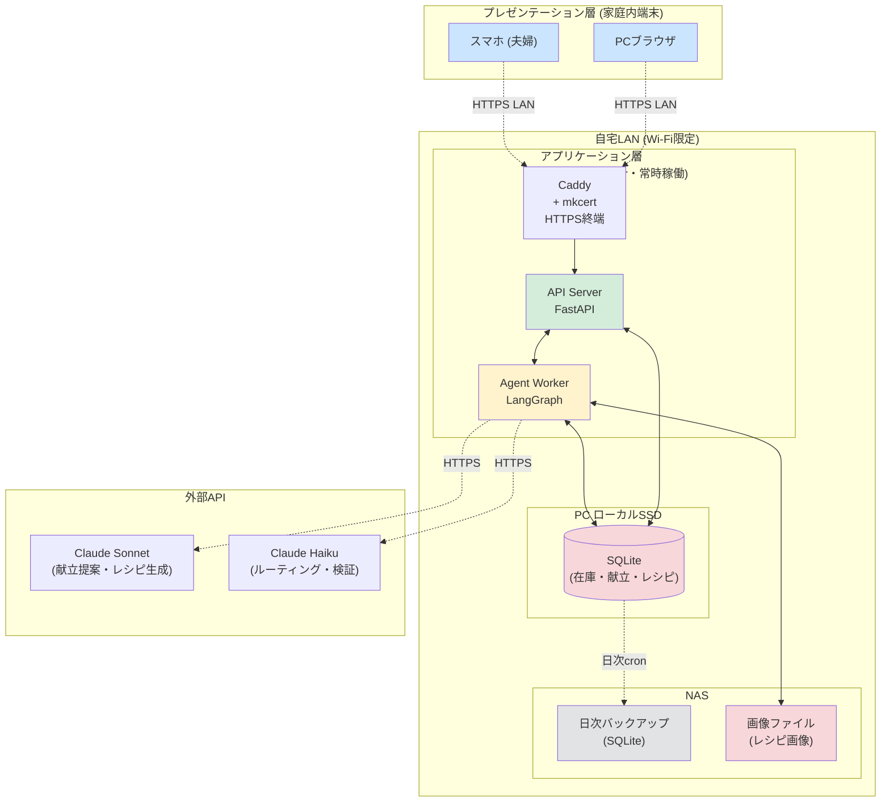
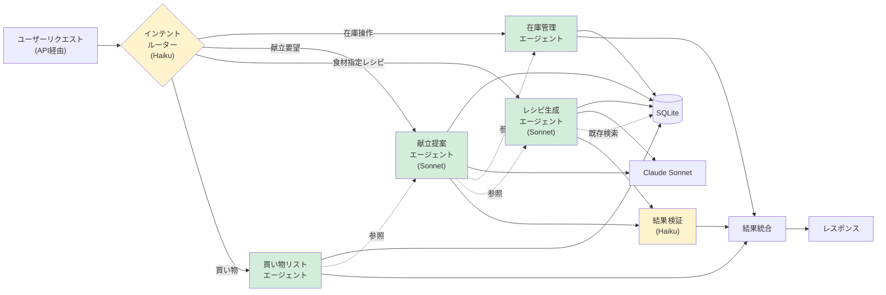
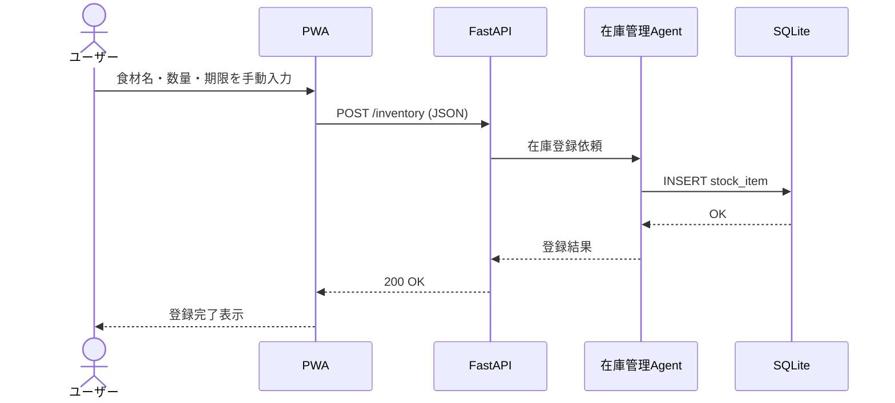
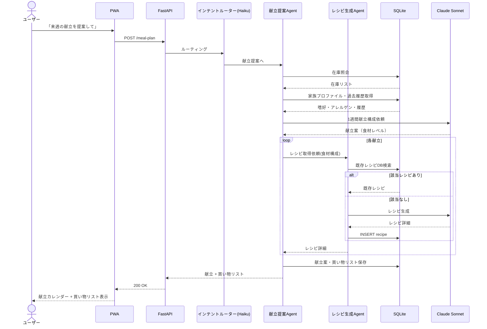
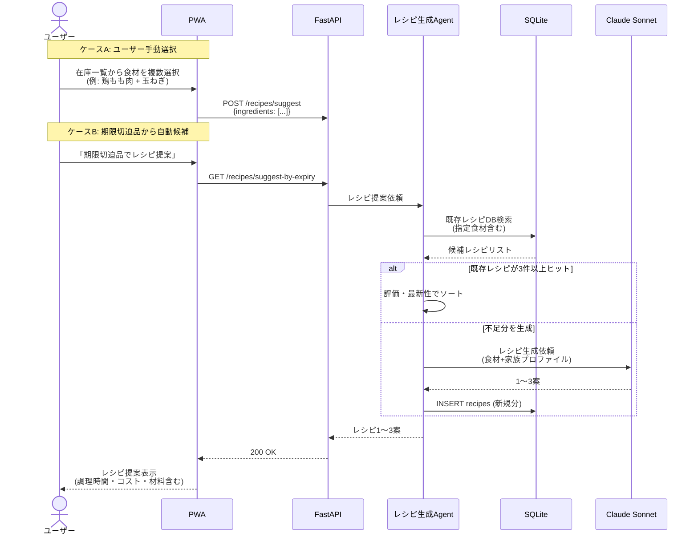
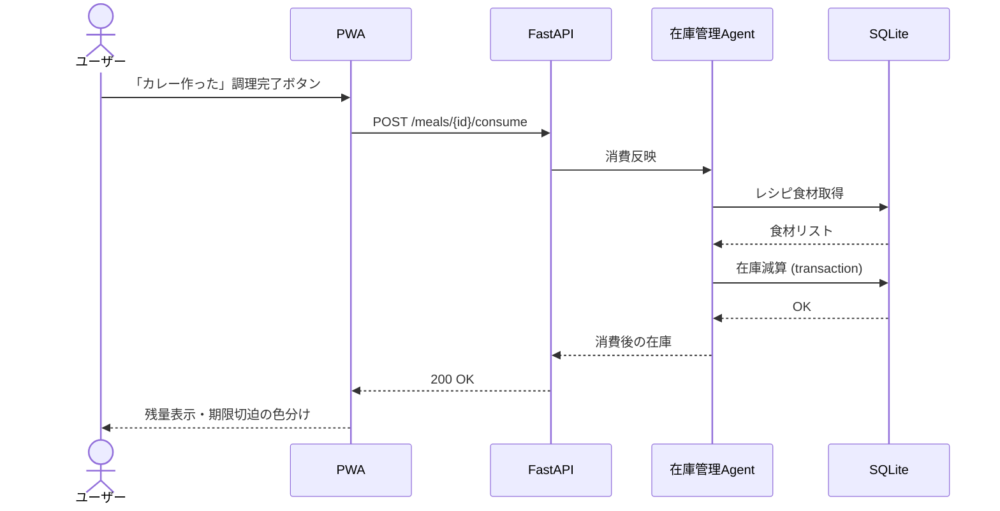
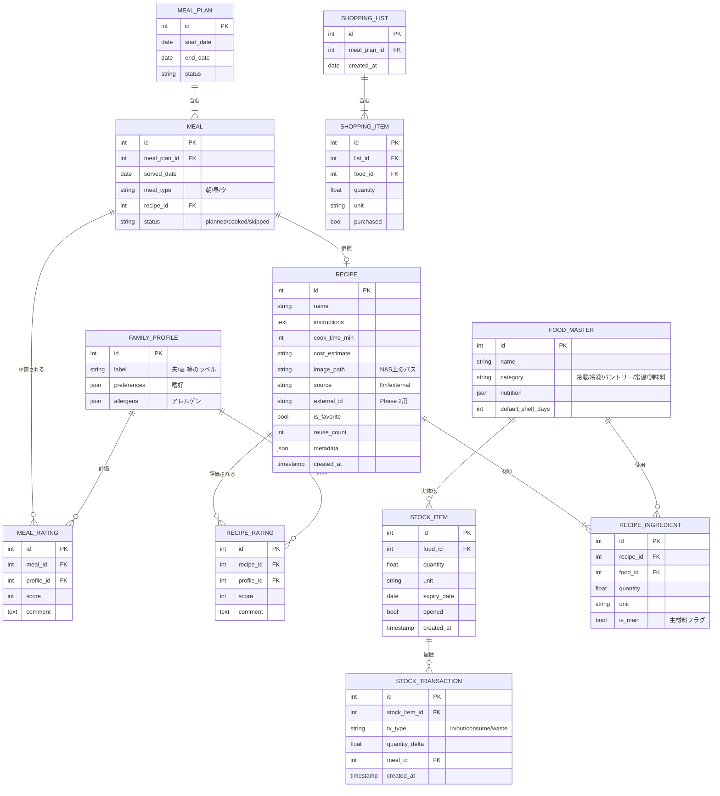
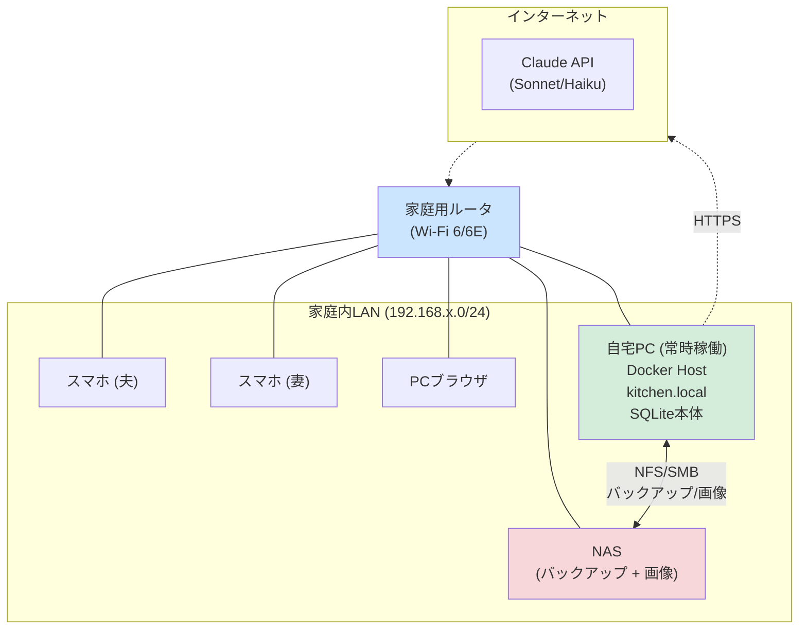
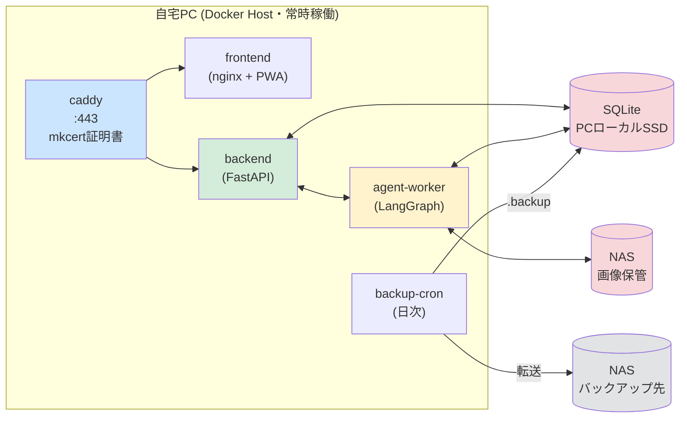

# システム構成図 v0.3

<document_meta>
- **対応要件定義書**: 要件定義書_v0.3.md
- **更新日**: 2026-05-22
- **変更点**: D-08改訂を反映（楽天レシピAPIを外部依存から除外、レシピ生成・DB蓄積に変更）、食材指定レシピ提案フローを追加
</document_meta>

---

## 1. 全体構成（MVP確定版）

<architecture_overview>

</architecture_overview>

### 各層の責務（MVP確定）

| 層 | 配置 | 責務 |
|----|------|------|
| プレゼンテーション | スマホ / PCブラウザ（LAN内） | UI、手動入力、状態管理、期限切迫色分け表示 |
| アプリケーション | 自宅PC（Docker常時稼働） | API、エージェントオーケストレーション、ビジネスロジック |
| データ（本体） | PCローカルSSD | SQLite（在庫・献立・**レシピDB**）|
| データ（保全） | NAS | 日次バックアップ、画像ファイル保存 |
| 外部API | インターネット | LLM（Sonnet/Haiku使い分け）のみ |

> **v0.3変更点**: 楽天レシピAPI接続を外部依存から除外。レシピは LLM 生成＋DB蓄積で完結する構成に。Phase 2 で楽天等の外部API連携を再検討。

---

## 2. エージェント内部構造（LangGraph・v0.3）

<agent_internal>

> **レシピ生成エージェントの動作**:
> 1. 受け取った食材・制約でDBを検索（F-RECIPE-02 再利用）
> 2. ヒットすればそれを返す（LLM呼び出し不要）
> 3. ヒットしなければ Sonnet で生成 → DBに保存 → 返却

</agent_internal>

---

## 3. 主要データフロー

### 3.1 在庫登録フロー（手動入力）

### 3.2 1週間献立提案フロー

### 3.3 食材指定レシピ提案フロー（v0.3新規 / F-MEAL-11）

### 3.4 消費（調理完了）フロー

---

## 4. データモデル概要（v0.3更新版・ER図）

<data_model>

</data_model>

> **v0.3でのデータモデル更新**:
> - `RECIPE` テーブルを独立した第一級エンティティに昇格（蓄積・再利用のため）
> - `MEAL_INGREDIENT` → `RECIPE_INGREDIENT` にリネーム（材料はレシピに紐づく）
> - `RECIPE_RATING` を追加（献立評価と区別、レシピそのものの評価）
> - `RECIPE.is_favorite`, `reuse_count`, `source`, `external_id` を追加
> - `RECIPE_INGREDIENT.is_main` を追加（食材指定レシピ提案のマッチング用）

---

## 5. 配備図（物理レイアウト）

<deployment>

> **v0.3変更点**: 外部接続先を Claude API のみに集約（楽天レシピAPIを削除）。

</deployment>

---

## 6. コンテナ構成（docker-compose 想定）

<container_layout>

</container_layout>

---

## 7. 変更履歴

### v0.2 → v0.3
| 領域 | 変更内容 |
|------|---------|
| 外部API | **楽天レシピAPIを削除**（Phase 2で再検討）|
| エージェント | レシピ取得エージェント → **レシピ生成エージェント**にリネーム＆責務変更 |
| 新フロー | **食材指定レシピ提案フロー（F-MEAL-11）を追加** |
| データモデル | RECIPE を独立エンティティに昇格、`is_favorite`/`reuse_count`/`source` 等を追加、RECIPE_RATING 新設 |
| 構成 | 外部接続を Claude API のみに集約 |

### v0.1 → v0.2
| 領域 | 変更内容 |
|------|---------|
| 外部API | Vision API 削除、楽天レシピAPI追加 |
| LLM | Sonnet/Haiku の使い分けを明示 |
| データ層 | SQLite本体をPCローカルSSDに配置、NASはバックアップ・画像のみ |
| エージェント | 通知エージェント削除、レシピ取得エージェント追加 |
| ネットワーク | 外部公開・VPN記述を削除、LAN内限定に簡素化 |
| データモデル | FAMILY_MEMBER → FAMILY_PROFILE に簡素化、離乳食関連属性削除 |
