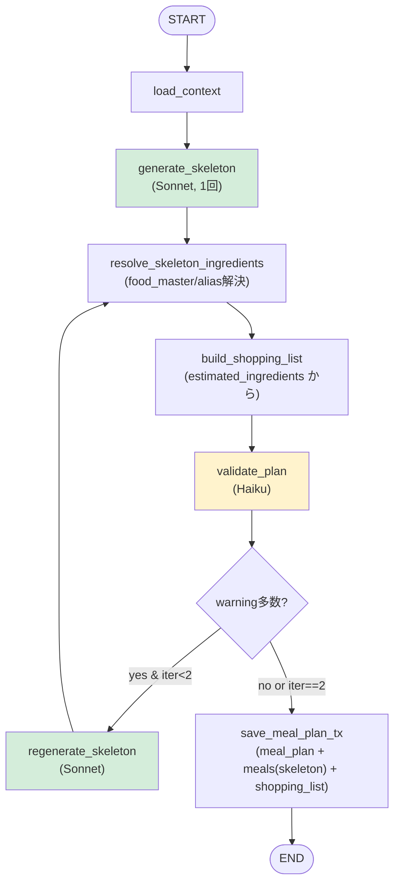
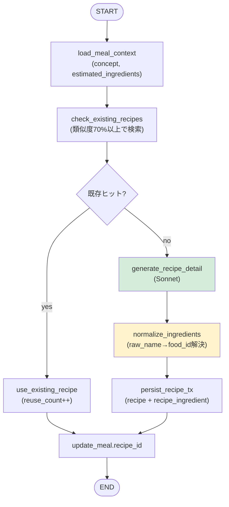
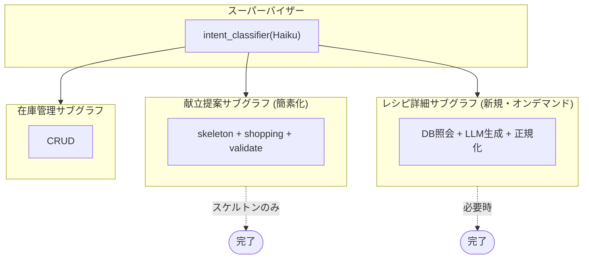
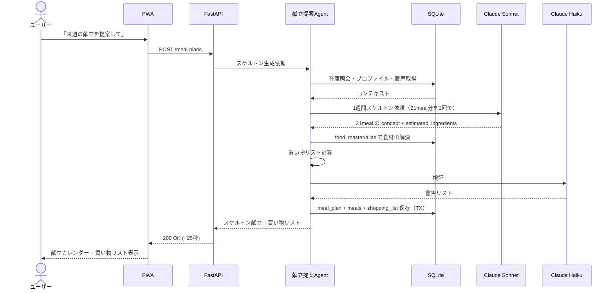
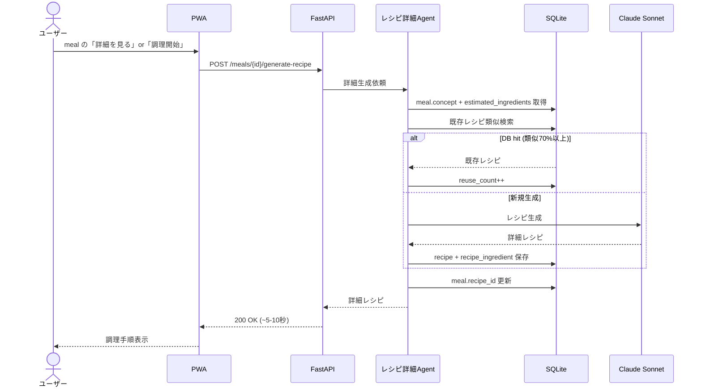

# 設計反映書 v0.4（Critical 3件への対応）

<document_meta>
- **作成日**: 2026-05-25
- **目的**: 包括レビュー v0.1 で発見された Critical 3件への連鎖修正を一括ドキュメント化
- **適用方針**: 既存文書（要件定義 v0.3 / システム構成図 v0.3 / データモデル v0.3 / OpenAPI v0.2 / LangGraph v0.1）に対する差分として読み、本書が最新仕様の確定版
- **影響範囲**: 要件、データモデル、OpenAPI、LangGraph、構成図の5文書すべて
</document_meta>

---

## 0. 対応サマリー

| ID | 内容 | 対応方針 |
|----|------|---------|
| C-01 | 管理エンドポイントが OpenAPI 未定義 | `/admin/*` グループ新設 |
| C-02 | レシピ生成時間予算が破綻 | 案A: スケルトン分離+詳細遅延+朝昼簡略 |
| C-03 | `/health` 仕様未定義 | 3層構成（root, live, ready）を OpenAPI に明記 |

---

# 1. C-02 レシピ生成時間予算対応（最重要）

## 1.1 全体方針（案A確定）

```
旧設計:
POST /meal-plans
  → load_context → generate_skeleton → recipe_loop(21回×8秒) → ...
  → 168秒（タイムアウト）❌

新設計:
POST /meal-plans
  → load_context → generate_skeleton(1回, ~15秒) → build_shopping_list → validate → save
  → ~25秒 ✅
  → meal.recipe_id は NULL（スケルトン状態）

POST /meals/{id}/recipe（オンデマンド）
  → DB照会 → 既存なら使用 / なければ LLM生成 → meal.recipe_id 更新
  → ~5-10秒（必要な meal だけ）

朝食/昼食: meal.recipe_id NULL のまま運用可（概要のみ表示）
夕食: ユーザーが「調理する」or「詳細を見る」で詳細生成
```

## 1.2 データモデル変更（v0.3 → v0.4）

### 1.2.1 meal テーブル — 3カラム追加

```sql
-- ALTER TABLE meal で追加
ALTER TABLE meal ADD COLUMN concept TEXT;
ALTER TABLE meal ADD COLUMN estimated_ingredients TEXT;  -- JSON配列
ALTER TABLE meal ADD COLUMN cook_time_min_estimate INTEGER;

-- PRAGMA user_version = 4;
```

| カラム | 型 | NULL | 説明 |
|--------|---|------|------|
| concept | TEXT | YES | 料理コンセプト（例: "鶏の照り焼き"） |
| estimated_ingredients | TEXT | YES | JSON配列、スケルトン時点の材料推定 |
| cook_time_min_estimate | INTEGER | YES | 概算調理時間 |

### 1.2.2 `estimated_ingredients` JSONスキーマ

**Phase 0c 実装版（簡略化）**:
```json
["豚肉", "玉ねぎ", "生姜", "醤油"]
```

- Phase 0c ではスケルトン生成時にLLMが返す食材名の文字列配列をそのまま保存
- food_id 解決（`resolve_skeleton_ingredients`）は Phase 1 で実装予定
- 詳細生成時は `recipe_ingredient` テーブルに展開する

**Phase 1 以降の拡張予定スキーマ**:
```json
[
  {"food_id": 12, "raw_name": null, "quantity": 300, "unit": "g", "is_main": true},
  {"food_id": 28, "raw_name": null, "quantity": 1, "unit": "個", "is_main": true},
  {"food_id": null, "raw_name": "みりん", "quantity": 30, "unit": "ml", "is_main": false}
]
```

- 買い物リスト生成は **`estimated_ingredients` ベース**で算出（recipe 詳細不要）

### 1.2.3 ER 図への影響

`MEAL` エンティティに3フィールド追加するのみ。リレーションは変わらず。

```mermaid
erDiagram
    MEAL {
        int id PK
        int meal_plan_id FK
        int recipe_id FK_nullable "詳細生成済みなら設定"
        text served_date
        string meal_type
        string status
        string concept "v0.4新規: スケルトン由来"
        text estimated_ingredients "v0.4新規: JSON配列"
        int cook_time_min_estimate "v0.4新規"
        text notes
        text created_at
        text updated_at
    }
```

### 1.2.4 既存クエリへの影響

- 4.4 (1週間献立取得): `concept`, `cook_time_min_estimate` を SELECT に追加
- 買い物リスト計算（9.1）: ロジックを `recipe_ingredient` ベース → `meal.estimated_ingredients` JSON ベースに変更

#### 新クエリ: 買い物リスト用必要量集計（v0.4）

```sql
-- 1週間分の meal から estimated_ingredients を集計
SELECT
    json_each.value as ingredient_json
FROM meal
CROSS JOIN json_each(meal.estimated_ingredients)
WHERE meal.meal_plan_id = ?
  AND meal.status != 'skipped';
-- アプリ層で food_id ごとに集約
```

### 1.2.5 トランザクション境界の更新

「7.3 1週間献立提案保存」を簡素化:

```
旧: meal_plan + 複数 meal + 複数 recipe + 複数 recipe_ingredient + shopping_list + ...
新: meal_plan + 複数 meal（concept等含む） + shopping_list + 複数 shopping_item
```

レシピ詳細生成は別トランザクションで実行（オンデマンド時）。

## 1.3 OpenAPI 変更（v0.2 → v0.3）

### 1.3.1 Meal スキーマ更新

```yaml
Meal:
  type: object
  properties:
    id: { type: integer }
    meal_plan_id: { type: integer, nullable: true }
    recipe_id: { type: integer, nullable: true, description: "詳細レシピ生成済みなら設定" }
    recipe: { $ref: '#/components/schemas/Recipe', nullable: true }
    served_date: { type: string, format: date }
    meal_type: { $ref: '#/components/schemas/MealType' }
    status: { $ref: '#/components/schemas/MealStatus' }
    # ★v0.4 新規フィールド
    concept: { type: string, nullable: true, description: "料理コンセプト" }
    estimated_ingredients:
      type: array
      nullable: true
      description: "スケルトン段階の材料推定"
      items:
        type: object
        properties:
          food_id: { type: integer, nullable: true }
          food_name: { type: string, nullable: true }
          raw_name: { type: string, nullable: true }
          quantity: { type: number, nullable: true }
          unit: { type: string, nullable: true }
          is_main: { type: boolean }
    cook_time_min_estimate: { type: integer, nullable: true }
    detail_status:
      type: string
      enum: [concept_only, full_recipe]
      description: "概要のみか詳細レシピ生成済みか（recipe_id の有無から派生）"
    notes: { type: string, nullable: true }
```

### 1.3.2 POST /meal-plans の動作明確化

```yaml
/meal-plans:
  post:
    summary: 献立計画生成（スケルトン）
    description: |
      LLM(Sonnet)で1週間献立のスケルトンを生成する。
      各 meal には concept, estimated_ingredients, cook_time_min_estimate が含まれる。
      詳細レシピ（recipe_id）は別途 POST /meals/{id}/generate-recipe で生成。
      
      想定応答時間: 15-25秒（Sonnet 1回呼出 + 検証 + 保存）。
      タイムアウト: 60秒（v0.4で短縮）。
    requestBody:
      required: true
      content:
        application/json:
          schema:
            $ref: '#/components/schemas/MealPlanCreate'
    responses:
      '200':
        description: スケルトン生成完了（詳細レシピは含まれない）
        content:
          application/json:
            schema:
              allOf:
                - $ref: '#/components/schemas/MealPlan'
                - type: object
                  properties:
                    skeleton_only: { type: boolean, example: true }
                    detail_generation_hint:
                      type: string
                      example: "夕食の詳細は /meals/{id}/generate-recipe で個別取得してください"
```

### 1.3.3 新規エンドポイント: POST /meals/{id}/generate-recipe

```yaml
/meals/{meal_id}/recipe:
  post:
    summary: meal の詳細レシピをオンデマンド生成
    description: |
      meal の concept と estimated_ingredients を元に詳細レシピを生成する。
      既存DB に類似レシピがあれば再利用（reuse_count++）、なければ Sonnet で新規生成。
      生成後 meal.recipe_id を設定する。
      
      想定応答時間: 5-10秒（DB hit時 < 1秒）
    tags: [Meals]
    parameters:
      - { name: meal_id, in: path, required: true, schema: { type: integer } }
    requestBody:
      content:
        application/json:
          schema:
            type: object
            properties:
              force_regenerate: { type: boolean, default: false, description: "既存 recipe_id があっても再生成" }
    responses:
      '200':
        description: 生成成功
        content:
          application/json:
            schema:
              type: object
              properties:
                recipe: { $ref: '#/components/schemas/Recipe' }
                source: { type: string, enum: [db_match, llm_generated] }
                meal: { $ref: '#/components/schemas/Meal' }
      '409':
        description: 既に recipe_id が設定済み（force_regenerate=false の場合）
```

### 1.3.4 既存エンドポイントの動作変更

- `POST /meals/{id}/consume`: meal.recipe_id が NULL かつ `auto_generate_recipe=true` クエリの場合、generate-recipe を内部で自動実行してから消費。あるいは `estimated_ingredients` を使って直接消費。後者を推奨（高速化）。
- `GET /meal-plans/{id}/shopping-list`: meal の `estimated_ingredients` から計算するように変更

### 1.3.5 タイムアウト目安表の更新

| エンドポイント | 想定応答時間 | 推奨タイムアウト |
|--------------|------------|----------------|
| POST `/meal-plans` | 15-25s | **60s**（v0.4で短縮） |
| POST `/meals/{id}/generate-recipe` | 5-10s | **30s** |
| POST `/recipes/suggest` | 5-15s | 30s |
| POST `/agent/chat` | 数秒〜30s | 60s |

→ Caddyfile の `read_timeout` を 90s → **60s** に変更

## 1.4 LangGraph 変更（v0.1 → v0.2）

### 1.4.1 meal_plan サブグラフの簡素化



**変更点（v0.1 比）**:
- `recipe_resolution_loop`（21回ループ）を削除
- `resolve_skeleton_ingredients` を新設（食材名→食材ID解決、レシピ生成はしない）
- 全体時間: 168秒 → ~25秒

### 1.4.2 新規サブグラフ: recipe_detail_generation



呼出元:
- `POST /meals/{id}/generate-recipe` から直接起動
- 必要に応じ `POST /meals/{id}/consume` の内部から呼出

### 1.4.3 LangGraph 全体図の更新



### 1.4.4 時間予算の再評価

| ノード | 想定時間 | 備考 |
|--------|---------|------|
| load_context | < 1s | DB クエリ |
| generate_skeleton (Sonnet) | 10-15s | 1回呼出で21meal分 |
| resolve_skeleton_ingredients | 1-2s | DB照会のみ、未解決は raw_name 保持 |
| build_shopping_list | 1-2s | JSON集約 |
| validate_plan (Haiku) | 3-5s | 警告チェック |
| persist | 1s | TX |
| **合計** | **~20-25s** | 60秒タイムアウト内に十分収まる |

## 1.5 要件定義変更（v0.3 → v0.4）

### 1.5.1 F-MEAL-09 の修正

```diff
- F-MEAL-09 | レシピ詳細 | 必須 | LLM(Sonnet)生成、調理手順、所要時間
+ F-MEAL-09 | レシピ詳細 | 必須 | meal 初回オープン時 or 「調理開始」時にオンデマンド生成（Sonnet）。
+                                  朝食/昼食はスケルトンのみで運用可。
```

### 1.5.2 新規 F-MEAL-12

```
F-MEAL-12 | スケルトン献立提案 | 必須 | 1週間献立を「料理コンセプト + 主材料 + 概算調理時間」レベルで一括提案。
                                       詳細レシピは別途オンデマンド生成。
                                       目的: タイムアウト回避とLLMコスト削減。
```

### 1.5.3 想定利用シナリオの更新

```diff
- 食材使用時の数量更新（消費記録）
+ 食材使用時の数量更新（消費記録、必要時はその場で詳細レシピを生成して参照）
```

### 1.5.4 第3章ロードマップ更新

Phase 1 (MVP) に追加:
- 1週間献立スケルトン提案（F-MEAL-12）
- 詳細レシピのオンデマンド生成

## 1.6 システム構成図変更（v0.3 → v0.4）

### 1.6.1 1週間献立提案フロー（簡素化版）



### 1.6.2 新規: 詳細レシピ生成フロー（オンデマンド）



---

# 2. C-01 管理エンドポイント追加

## 2.1 OpenAPI 追加スキーマ

```yaml
NormalizationResult:
  type: object
  properties:
    processed_count: { type: integer }
    matched_to_existing: { type: integer }
    new_aliases_created: { type: integer }
    flagged_for_review: { type: integer }
    duration_ms: { type: integer }

LlmCostSummary:
  type: object
  properties:
    period:
      type: object
      properties:
        from: { type: string, format: date }
        to: { type: string, format: date }
    total_calls: { type: integer }
    total_input_tokens: { type: integer }
    total_output_tokens: { type: integer }
    total_cost_yen_estimate: { type: number }
    by_model:
      type: object
      additionalProperties:
        type: object
        properties:
          calls: { type: integer }
          tokens: { type: integer }
          cost_yen: { type: number }
    by_purpose:
      type: object
      additionalProperties:
        type: object
        properties:
          calls: { type: integer }
          cost_yen: { type: number }
```

## 2.2 OpenAPI 追加パス

```yaml
/admin/normalize-food-aliases:
  post:
    summary: 食材名正規化バッチを起動
    description: |
      recipe_ingredient.food_id IS NULL の行を抽出し、Haiku で正規化する。
      cron からの定期実行が主用途。同期/非同期は処理件数に依存。
    tags: [Admin]
    requestBody:
      content:
        application/json:
          schema:
            type: object
            properties:
              limit: { type: integer, default: 50, description: "1回の処理上限" }
              confidence_threshold: { type: number, default: 0.7 }
    responses:
      '200':
        description: 処理結果
        content:
          application/json:
            schema: { $ref: '#/components/schemas/NormalizationResult' }

/admin/llm-cost-summary:
  get:
    summary: LLM呼出履歴サマリ
    description: 期間内の LLM 呼出統計（モデル別、用途別のコスト集計）
    tags: [Admin]
    parameters:
      - { name: from, in: query, schema: { type: string, format: date } }
      - { name: to, in: query, schema: { type: string, format: date } }
    responses:
      '200':
        description: サマリ
        content:
          application/json:
            schema: { $ref: '#/components/schemas/LlmCostSummary' }
```

## 2.3 Phase 2 で導入予定

- データモデル設計書 v0.2 で言及していた `llm_call_log` テーブルを Phase 2 で実装し、`/admin/llm-cost-summary` が参照する想定
- MVP では LangSmith のデータを集計する代替実装も可

---

# 3. C-03 ヘルスチェック仕様

## 3.1 OpenAPI 追加パス

```yaml
# 3.1.1 ルートレベル（Caddy が直接応答、認証なし）
# OpenAPI 上は記載するが、実際の応答は Caddy 内部で完結
/health:
  get:
    summary: 単純な生存確認（Caddy 応答）
    security: []  # 認証スキップ
    tags: [Health]
    responses:
      '200':
        description: OK
        content:
          text/plain:
            schema: { type: string, example: "OK" }

# 3.1.2 backend プロセス生存確認
/api/v1/health/live:
  get:
    summary: backend プロセス生存確認（認証スキップ）
    security: []
    tags: [Health]
    responses:
      '200':
        description: 生存
        content:
          application/json:
            schema:
              type: object
              properties:
                status: { type: string, example: "alive" }
                uptime_sec: { type: integer }
                version: { type: string }

# 3.1.3 readiness（DB・LLM接続確認、認証必要）
/api/v1/health/ready:
  get:
    summary: 依存システムを含めた準備完了確認
    tags: [Health]
    responses:
      '200':
        description: 準備完了
        content:
          application/json:
            schema:
              type: object
              properties:
                status: { type: string, enum: [ready, degraded, not_ready] }
                checks:
                  type: object
                  properties:
                    db: { type: object, properties: { ok: { type: boolean }, latency_ms: { type: integer } } }
                    llm: { type: object, properties: { ok: { type: boolean }, latency_ms: { type: integer } } }
                    nas_mount: { type: object, properties: { ok: { type: boolean }, writable: { type: boolean } } }
      '503':
        description: 準備未完了
```

## 3.2 各ヘルスチェックの責務分離

| エンドポイント | 認証 | 応答時間 | 用途 |
|--------------|-----|---------|------|
| `GET /health` | なし | < 10ms | Caddy 直接応答、外部監視 |
| `GET /api/v1/health/live` | なし | < 100ms | backend プロセス疎通確認 |
| `GET /api/v1/health/ready` | あり | < 500ms | DB・LLM・NAS 接続確認、運用時のヘルスチェック |

## 3.3 docker-compose 修正

```yaml
backend:
  healthcheck:
    test: ["CMD", "curl", "-fsS", "http://localhost:8000/api/v1/health/live"]
    # /health → /api/v1/health/live に変更（より正確）

caddy:
  healthcheck:
    test: ["CMD", "wget", "--quiet", "--spider", "http://localhost:80/health"]
    # Caddy 自体の /health（root level）はそのまま
```

## 3.4 Caddyfile 修正

```caddyfile
# 既存のまま維持
handle /health {
    respond "OK" 200
}

# 認証不要な /api/v1/health/live は backend に転送（認証ミドルウェアでスキップ）
# /api/v1/health/ready は通常の認証経由
```

---

# 4. 検証マトリクス

| 観点 | C-01 | C-02 | C-03 |
|------|------|------|------|
| 要件定義反映 | - | F-MEAL-09修正、F-MEAL-12新規 | - |
| データモデル | - | meal 3カラム追加 | - |
| OpenAPI | /admin/* 追加 | Meal スキーマ、POST /meal-plans 動作、POST /meals/{id}/generate-recipe | /health 3層 |
| LangGraph | - | meal_plan 簡素化、recipe_detail 新規 | - |
| 構成図 | - | シーケンス図2点更新 | - |
| docker-compose | - | Caddy timeout 90→60、healthcheck パス変更 | healthcheck パス変更 |

---

# 5. v0.4 反映後の文書バージョン状態

| 文書 | ファイル上のバージョン | 状態 |
|------|------------|-----|
| 要件定義書 | v0.3 + 本書 §1.5 | v0.4 として読む |
| システム構成図 | v0.3 + 本書 §1.6 | v0.4 として読む |
| データモデル詳細設計書 | v0.3 + 本書 §1.2 | v0.4 として読む |
| OpenAPI設計書 | **v0.3**（2026-06-05 更新済み） | 本書 §1.3, §2, §3 取り込み済み |
| LangGraphステートグラフ設計書 | **v0.2**（2026-06-05 更新済み） | 本書 §1.4 取り込み済み・Phase 0c 実装反映 |
| docker-compose設計書 | v0.1 + 本書 §3.3 | v0.2 として読む |

将来 v0.5 系で大規模変更がある場合、本書の内容を取り込んだフルバージョンを別途作成する。

---

# 6. 残課題（Important / Strategic）

包括レビューで挙げた 🟡 Important および 🔵 Strategic 案件は実装フェーズと並行で対応:

| ID | 優先度 | 対応タイミング |
|----|------|--------------|
| I-01 (shopping→food昇格動線) | 🟡 | Phase 0b 実装時に API クライアントで実装 |
| I-02 (warnings構造化) | 🟡 | Phase 0c 実装時 |
| I-03 (ツール詳細仕様) | 🟡 | LangGraph 実装時に inline で記述 |
| I-04 (PWA設計) | 🟡 | フロント実装着手前に簡易設計 |
| S-01 (Phase 2移行戦略) | 🔵 | Phase 1完了時 |
| S-02 (家族オンボーディング) | 🔵 | PWA設計と連動 |
| S-03 (LLM予算監視) | 🔵 | Phase 1後半 |
| S-04 (APIバージョン互換) | 🔵 | Phase 2以降 |

---

# 7. 次のアクション

1. ~~包括レビュー~~ ✅
2. ~~C-02 方針決定（案A）~~ ✅
3. ~~C-01/C-02/C-03 連鎖修正反映~~ ✅本書
4. ~~PoC実装~~ ✅（2026-06-05完了）
   - ~~Phase 0a: docker-compose 起動、DB マイグレーション、health endpoints 実装~~ ✅
   - ~~Phase 0b: 在庫CRUD最小実装~~ ✅
   - ~~Phase 0c: スケルトン献立提案 + 詳細レシピ生成サブグラフの単体実装~~ ✅
     - 実装: `build_skeleton_graph`（Sonnet）、`build_recipe_graph`（Sonnet）
     - パス: `POST /api/v1/meal-plans`、`POST /api/v1/meals/{id}/recipe`
5. **Phase 1: PWA MVP** ← 次はここ
6. PWA 簡易設計（Phase 1 着手前に）

